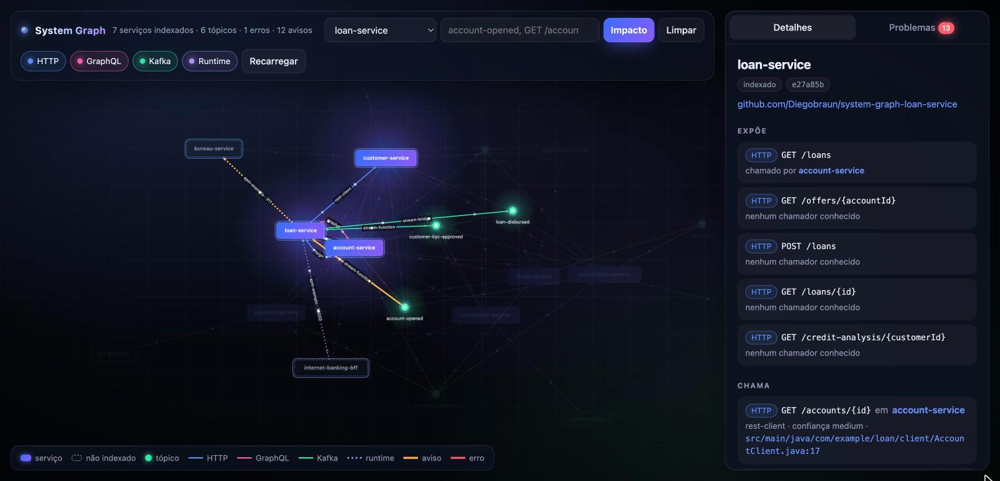

# loan-service

Serviço de empréstimos. Usa **Spring Cloud Stream** (funções `Consumer` e `StreamBridge`) para Kafka e chama o
account-service de três jeitos, de propósito, para exercitar o extrator: **`RestClient`**, **HTTP Interface
(`@HttpExchange`)** e **GraphQL** (`HttpSyncGraphQlClient`). O customer-service é chamado com **`RestClient`**.



*O loan-service na [interface visual](https://github.com/Diegobraun/system-graph-poc#interface-visual) da plataforma: tudo que ele chama, expõe, publica e consome.*

## Contratos

| Tipo | Contrato | Detalhe |
|---|---|---|
| REST exposto | `POST /loans` | pede empréstimo: `accountId`, `amount`, `installments` |
| REST exposto | `GET /loans/{id}` | consulta empréstimo |
| REST exposto | `GET /loans?accountId=` | empréstimos de uma conta, chamado pelo account-service via Feign |
| REST exposto | `GET /credit-analysis/{customerId}` | renda, saldo das contas, faixa de risco e valor máximo de empréstimo |
| REST exposto | `GET /offers/{accountId}` | oferta pré-aprovada criada ao abrir a conta, com a flag `kycApproved` |
| REST chamado | `GET /accounts/{id}` no account-service | `AccountClient`, cadeia `restClient.get().uri(...)` |
| REST chamado | `GET /customers/{id}` no account-service | `CustomerApi`, interface `@HttpExchange` criada em `HttpClientsConfig` |
| GraphQL chamado | `query customer` no account-service | `CustomerProfileClient`, documento [`customerProfile.graphql`](src/main/resources/graphql-documents/customerProfile.graphql) |
| REST chamado | `GET /risk-profiles/{customerId}` no customer-service | `RiskProfileClient`, `RestClient` |
| Kafka consome | `account-opened` | função `accountOpened`, cria a oferta pré-aprovada |
| Kafka consome | `customer-kyc-approved` | função `customerKycApproved`, marca a oferta com `kycApproved` |
| Kafka publica | `loan-disbursed` | `StreamBridge` no binding `loanDisbursed-out-0` |

## Regras

- Empréstimo aprovado se a conta está `ACTIVE` e o valor é no máximo 5 vezes a renda mensal. A conta só fica
  `ACTIVE` depois do KYC aprovado no customer-service.
- Oferta pré-aprovada: 3 vezes a renda mensal que chega no evento `account-opened`. Se `customer-kyc-approved`
  chegar antes, a oferta já nasce com `kycApproved: true`.
- Análise de crédito: o valor máximo é a renda vezes um multiplicador pela faixa de risco do customer-service
  (`LOW` 6, `MEDIUM` 5, `HIGH` 2). Sem perfil ou sem resposta do customer-service, `riskTier` vem `null` e o
  multiplicador é 5.

## A divergência proposital

`AccountOpenedEvent` deste serviço tem `monthlyIncome`, mas o account-service não envia esse campo. O
Jackson preenche `null` e a oferta sai com limite zero, sem erro nenhum. O `find_contract_issues` do MCP
server da plataforma aponta isso. Para corrigir, o account-service passaria a enviar a renda no evento, ou o loan-service
buscaria a renda via `GET /customers/{id}` como já faz no pedido de empréstimo.

## Manifesto

[`system-graph.yml.example`](system-graph.yml.example) mostra como declarar dependências que a análise estática
não consegue ver. Renomeado para `system-graph.yml`, o extrator soma essas entradas ao grafo com
`source: manifest`.

## Rodando sozinho

```bash
mvn spring-boot:run
```

Porta 8082. Precisa do Kafka e do account-service em `localhost:8081`. O customer-service em `localhost:8083` é
opcional (sem ele a análise de crédito usa o multiplicador padrão). O Kafka sobe com o `docker-compose.yml` da
[plataforma](https://github.com/Diegobraun/system-graph-poc), e o `scripts/start-all.sh` de lá sobe todos os
serviços juntos.

## Parte da POC system-graph

Este repositório é um dos serviços da POC [system-graph](https://github.com/Diegobraun/system-graph-poc), que dá a assistentes de IA uma visão
dos contratos entre serviços que vivem em repositórios diferentes.

| Repositório | Papel |
|---|---|
| [system-graph-poc](https://github.com/Diegobraun/system-graph-poc) | Plataforma: extrator, MCP server, templates de CI, docker-compose e docs |
| [system-graph-account-service](https://github.com/Diegobraun/system-graph-account-service) | Clientes e contas |
| [system-graph-loan-service](https://github.com/Diegobraun/system-graph-loan-service) | Empréstimos |
| [system-graph-customer-service](https://github.com/Diegobraun/system-graph-customer-service) | KYC e perfil de risco |
| [system-graph-payment-service](https://github.com/Diegobraun/system-graph-payment-service) | Pagamentos Pix |
| [system-graph-notification-service](https://github.com/Diegobraun/system-graph-notification-service) | Notificações |
| [system-graph-investment-service](https://github.com/Diegobraun/system-graph-investment-service) | Investimentos |
| [system-graph-fraud-service](https://github.com/Diegobraun/system-graph-fraud-service) | Antifraude |

### O que este repositório tem para o grafo

- **`.github/workflows/system-graph.yml`**: a cada push na `main`, compila, baixa o `graph-extractor.jar` da
  release da plataforma, extrai o `service-graph.json` e publica como artefato do workflow. Se os secrets
  `NEO4J_URI`, `NEO4J_USER` e `NEO4J_PASSWORD` existirem, também grava no Neo4j.
- **`.gitlab-ci.yml`**: o mesmo job no formato GitLab, incluindo o template da plataforma. É o que um serviço da
  empresa teria.
- **`.mcp.json`** e **`CLAUDE.md`**: conectam o assistente ao MCP server e dizem quando consultar o grafo.

O extrator só enxerga este repositório. O cruzamento com os outros serviços acontece no grafo central.
